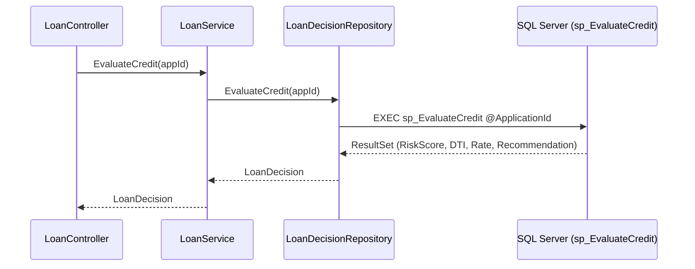
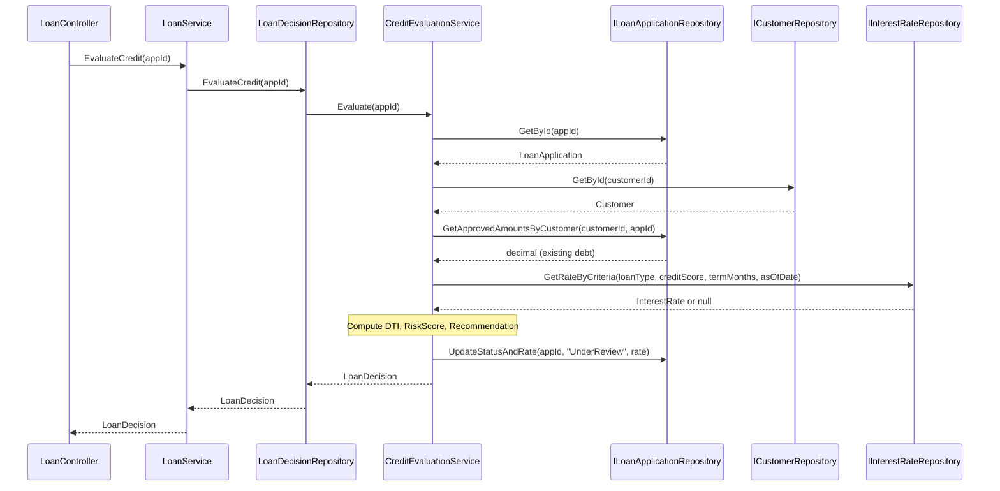
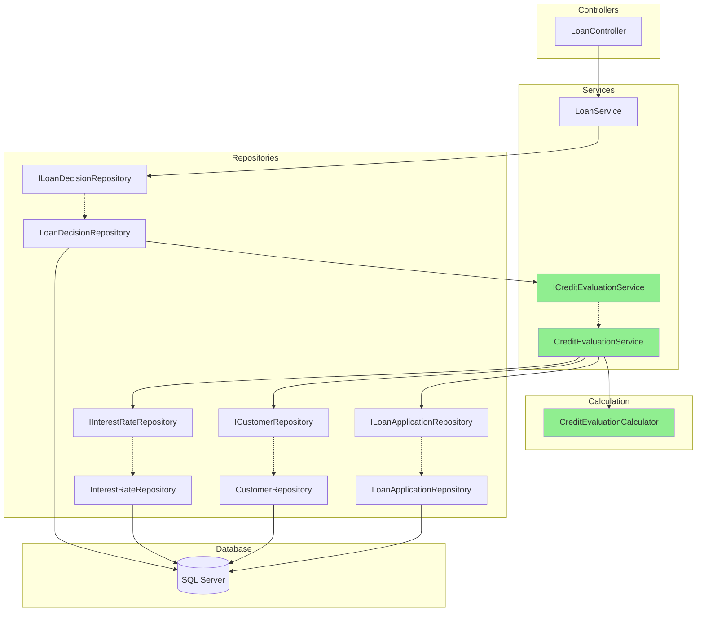
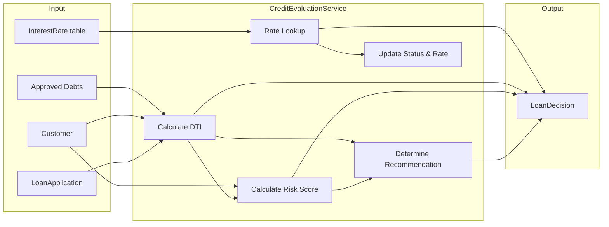

# Design Document: Credit Evaluation Extraction

## Overview

This design extracts the credit evaluation business logic from the `sp_EvaluateCredit` SQL Server stored procedure into the `CreditEvaluationService` in the .NET service layer. The extraction follows the strangler pattern: the stored procedure remains in the database for rollback, but runtime traffic is redirected to the C# implementation.

`ICreditEvaluationService` and `CreditEvaluationService` already exist as an SP-backed stub — the service currently delegates to `sp_EvaluateCredit` via SqlCommand, producing identical results to the stored procedure. This stub was created during the shadow-comparison-validation phase to establish the service seam. The extraction replaces the stub's internals with pure C# computation via `CreditEvaluationCalculator` and repository data access.

The key integration point is `LoanDecisionRepository.EvaluateCredit`. Today it calls `sp_EvaluateCredit` directly via ADO.NET. After extraction, it delegates to `CreditEvaluationService.Evaluate`, which performs all computation in C# and reads/writes data through repository interfaces. The `LoanService` layer above is untouched — it continues to call `ILoanDecisionRepository.EvaluateCredit` as before.

The shadow comparison test infrastructure is already in place — it compares SP output against the service output for 5 curated profiles. Pre-extraction, this comparison is trivially SP-vs-SP. Post-extraction, it becomes a real SP-vs-C# equivalence check.

This is the first stored procedure extraction and establishes the pattern for the remaining three (`sp_ProcessLoanDecision`, `sp_CalculatePaymentSchedule`, `sp_GeneratePortfolioReport`).

### Design Decisions and Rationale

1. **Monolith with clean interfaces**: The service lives in the same `LoanProcessing.Web` project but is designed with clean DTOs and interface boundaries so it can be extracted to a microservice or agent tool later.
2. **Repository-only data access**: `CreditEvaluationService` never touches `SqlConnection` directly. All data flows through `ICustomerRepository`, `ILoanApplicationRepository`, and `IInterestRateRepository`.
3. **Redirect at the repository level**: `LoanDecisionRepository.EvaluateCredit` is the single point of change. It receives the `ICreditEvaluationService` via constructor injection and delegates to it. This keeps `LoanService` unchanged and satisfies the existing validation tests.
4. **Pure computation functions**: The risk score, DTI, and recommendation calculations are implemented as static pure functions on a helper class (`CreditEvaluationCalculator`). This makes them trivially unit-testable and property-testable without any database or mock setup.
5. **New repository methods instead of in-memory filtering**: Two new repository methods are added (`IInterestRateRepository.GetRateByCriteria` and `ILoanApplicationRepository.GetApprovedAmountsByCustomer`) to push filtering to the database, matching the stored procedure's behavior.

## Architecture

### Current Call Chain



### Target Call Chain



### Component Diagram



Green nodes are new components introduced by this extraction. Yellow nodes already exist as stubs and will be modified.


## Components and Interfaces

### New Components

#### 1. `ICreditEvaluationService` (Interface — Already Exists)

**Namespace:** `LoanProcessing.Web.Services`
**File:** `LoanProcessing.Web/Services/ICreditEvaluationService.cs`

Already created during shadow-comparison-validation phase. No changes needed to the interface.

```csharp
namespace LoanProcessing.Web.Services
{
    public interface ICreditEvaluationService
    {
        LoanDecision Evaluate(int applicationId);
    }
}
```

#### 2. `CreditEvaluationService` (Implementation — Exists as SP-Backed Stub, Needs Replacement)

**Namespace:** `LoanProcessing.Web.Services`
**File:** `LoanProcessing.Web/Services/CreditEvaluationService.cs`

Currently delegates to `sp_EvaluateCredit` via SqlCommand. The extraction replaces the internals with calculator + repository logic.

Post-extraction dependencies (constructor-injected):
- `ILoanApplicationRepository` — fetch application, get approved amounts, update status/rate
- `ICustomerRepository` — fetch customer (credit score, annual income)
- `IInterestRateRepository` — look up applicable interest rate

Responsibilities:
1. Load application and customer data via repositories
2. Calculate existing debt via `ILoanApplicationRepository.GetApprovedAmountsByCustomer`
3. Delegate DTI, risk score, and recommendation computation to `CreditEvaluationCalculator`
4. Look up interest rate via `IInterestRateRepository.GetRateByCriteria`, defaulting to 12.99%
5. Update application status to "UnderReview" and set interest rate via `ILoanApplicationRepository.UpdateStatusAndRate`
6. Return a populated `LoanDecision`

```csharp
namespace LoanProcessing.Web.Services
{
    public class CreditEvaluationService : ICreditEvaluationService
    {
        private readonly ILoanApplicationRepository _loanAppRepo;
        private readonly ICustomerRepository _customerRepo;
        private readonly IInterestRateRepository _rateRepo;

        public CreditEvaluationService(
            ILoanApplicationRepository loanAppRepo,
            ICustomerRepository customerRepo,
            IInterestRateRepository rateRepo) { ... }

        public LoanDecision Evaluate(int applicationId) { ... }
    }
}
```

#### 3. `CreditEvaluationCalculator` (Static Helper — To Be Created)

**Namespace:** `LoanProcessing.Web.Services`
**File:** `LoanProcessing.Web/Services/CreditEvaluationCalculator.cs`

Does not exist yet — this is the primary deliverable of the extraction. Pure functions with no dependencies — the primary target for property-based testing.

```csharp
namespace LoanProcessing.Web.Services
{
    public static class CreditEvaluationCalculator
    {
        public const decimal DefaultInterestRate = 12.99m;

        /// <summary>
        /// Computes DTI ratio: ((existingDebt + requestedAmount) / annualIncome) * 100
        /// </summary>
        public static decimal CalculateDtiRatio(
            decimal existingDebt, decimal requestedAmount, decimal annualIncome);

        /// <summary>
        /// Computes the credit score component of the risk score.
        /// 750+ → 10, 700+ → 20, 650+ → 35, 600+ → 50, below 600 → 75
        /// </summary>
        public static int CalculateCreditScoreComponent(int creditScore);

        /// <summary>
        /// Computes the DTI component of the risk score.
        /// DTI ≤ 20 → 0, ≤ 35 → 10, ≤ 43 → 20, > 43 → 30
        /// </summary>
        public static int CalculateDtiComponent(decimal dtiRatio);

        /// <summary>
        /// Computes total risk score = CreditScoreComponent + DtiComponent, clamped to [0, 100].
        /// </summary>
        public static int CalculateRiskScore(int creditScore, decimal dtiRatio);

        /// <summary>
        /// Determines recommendation based on risk score and DTI ratio.
        /// </summary>
        public static string DetermineRecommendation(int riskScore, decimal dtiRatio);
    }
}
```

### Modified Components

#### 4. `LoanDecisionRepository` (Modified)

**Change:** The `EvaluateCredit` method stops calling `sp_EvaluateCredit` and instead delegates to `ICreditEvaluationService.Evaluate`.

**Constructor change:** Add `ICreditEvaluationService` as a constructor parameter. The `LoanDecisionRepository(string connectionString)` constructor (used by `LoanController` and `ValidationService`) must wire up the full dependency chain manually, consistent with the existing legacy DI pattern.

```csharp
// New constructor signature
public LoanDecisionRepository(string connectionString, ICreditEvaluationService creditEvalService)

// Updated EvaluateCredit — no more SqlCommand/sp_EvaluateCredit
public LoanDecision EvaluateCredit(int applicationId)
{
    return _creditEvalService.Evaluate(applicationId);
}
```

The `(string connectionString)` constructor creates the full chain (callers like `LoanController` and `ValidationService` use this constructor):
```csharp
public LoanDecisionRepository(string connectionString)
    : this(connectionString,
          new CreditEvaluationService(
              new LoanApplicationRepository(connectionString),
              new CustomerRepository(connectionString),
              new InterestRateRepository(connectionString)))
{
}
```

#### 5. `IInterestRateRepository` (Extended)

**New method:**

```csharp
/// <summary>
/// Finds the best matching interest rate for the given criteria.
/// Matches on loan type, credit score within [MinCreditScore, MaxCreditScore],
/// term within [MinTermMonths, MaxTermMonths], effective on or before asOfDate,
/// not expired as of asOfDate. Returns the most recently effective match, or null.
/// </summary>
InterestRate GetRateByCriteria(string loanType, int creditScore, int termMonths, DateTime asOfDate);
```

**Implementation in `InterestRateRepository`:** Single SQL query matching the stored procedure's `SELECT TOP 1 ... ORDER BY EffectiveDate DESC` logic.

#### 6. `ILoanApplicationRepository` (Extended)

**New methods:**

```csharp
/// <summary>
/// Returns the sum of ApprovedAmount for all approved applications for the given customer,
/// excluding the specified application.
/// </summary>
decimal GetApprovedAmountsByCustomer(int customerId, int excludeApplicationId);

/// <summary>
/// Updates the application's Status and InterestRate columns.
/// </summary>
void UpdateStatusAndRate(int applicationId, string status, decimal interestRate);
```

**Implementation in `LoanApplicationRepository`:** Direct SQL queries matching the stored procedure's behavior.

### Unchanged Components

- **`ILoanService` / `LoanService`**: No changes. `LoanService.EvaluateCredit` continues to call `_decisionRepo.EvaluateCredit(applicationId)`.
- **`LoanController`**: No changes. Continues to call `_loanService.EvaluateCredit(id)`.
- **`ValidationService`**: The wiring in `ValidationService` constructor creates `LoanDecisionRepository(connectionString)`. This parameterless-ish constructor (taking connection string) needs to be updated to also create and inject the `CreditEvaluationService`. The `LoanService` constructor call remains unchanged.
- **`sp_EvaluateCredit`**: Remains in the database, unchanged, for rollback.


## Data Models

### Existing Models (Unchanged)

All existing models are reused as-is. No new database tables or entity classes are needed.

#### `LoanApplication` (Entity)
Key fields used by credit evaluation:
- `ApplicationId` (int) — primary key
- `CustomerId` (int) — FK to Customer
- `LoanType` (string) — "Personal", "Auto", "Mortgage", "Business"
- `RequestedAmount` (decimal) — the loan amount requested
- `TermMonths` (int) — loan term in months
- `Status` (string) — "Pending" → "UnderReview" after evaluation
- `InterestRate` (decimal?) — set during evaluation

#### `Customer` (Entity)
Key fields used by credit evaluation:
- `CustomerId` (int) — primary key
- `CreditScore` (int) — 300–850 range
- `AnnualIncome` (decimal) — must be > 0 for valid evaluation

#### `InterestRate` (Entity)
Used for rate lookup:
- `LoanType` (string) — matches application loan type
- `MinCreditScore` / `MaxCreditScore` (int) — credit score range
- `MinTermMonths` / `MaxTermMonths` (int) — term range
- `Rate` (decimal) — the interest rate percentage
- `EffectiveDate` (DateTime) — when the rate becomes active
- `ExpirationDate` (DateTime?) — null means no expiration

#### `LoanDecision` (Entity / DTO)
Returned by `CreditEvaluationService.Evaluate`:
- `ApplicationId` (int) — the evaluated application
- `RiskScore` (int?) — 0–100, lower is better
- `DebtToIncomeRatio` (decimal?) — DTI percentage
- `InterestRate` (decimal?) — selected or default rate
- `Comments` (string) — contains the Recommendation text

### Data Flow



### Calculation Rules (from sp_EvaluateCredit)

**DTI Ratio:**
`((ExistingApprovedDebt + RequestedAmount) / AnnualIncome) * 100`

**Credit Score Component:**
| Credit Score | Component |
|---|---|
| ≥ 750 | 10 |
| ≥ 700 | 20 |
| ≥ 650 | 35 |
| ≥ 600 | 50 |
| < 600 | 75 |

**DTI Component:**
| DTI Ratio | Component |
|---|---|
| ≤ 20 | 0 |
| ≤ 35 | 10 |
| ≤ 43 | 20 |
| > 43 | 30 |

**Risk Score:** `CreditScoreComponent + DTIComponent` (clamped to 0–100)

**Recommendation:**
| Condition | Recommendation |
|---|---|
| RiskScore ≤ 30 AND DTI ≤ 35 | "Recommended for Approval" |
| RiskScore ≤ 50 AND DTI ≤ 43 | "Manual Review Required" |
| Otherwise | "High Risk - Recommend Rejection" |

**Interest Rate Lookup:**
- Match on LoanType, CreditScore in [Min, Max], TermMonths in [Min, Max], EffectiveDate ≤ today, ExpirationDate is null or ≥ today
- Pick most recent EffectiveDate
- Default to 12.99% if no match


## Correctness Properties

*A property is a characteristic or behavior that should hold true across all valid executions of a system — essentially, a formal statement about what the system should do. Properties serve as the bridge between human-readable specifications and machine-verifiable correctness guarantees.*

### Property 1: DTI Ratio Calculation

*For any* positive annual income, any non-negative existing debt, and any positive requested amount, `CalculateDtiRatio(existingDebt, requestedAmount, annualIncome)` shall equal `((existingDebt + requestedAmount) / annualIncome) * 100`.

**Validates: Requirements 1.2, 1.3, 8.2**

### Property 2: Credit Score Component Bracket Mapping

*For any* credit score in the range [300, 850], `CalculateCreditScoreComponent(creditScore)` shall return 10 when creditScore ≥ 750, 20 when creditScore ≥ 700, 35 when creditScore ≥ 650, 50 when creditScore ≥ 600, and 75 when creditScore < 600.

**Validates: Requirements 2.1, 8.1**

### Property 3: DTI Component Bracket Mapping

*For any* non-negative DTI ratio, `CalculateDtiComponent(dtiRatio)` shall return 0 when dtiRatio ≤ 20, 10 when dtiRatio ≤ 35, 20 when dtiRatio ≤ 43, and 30 when dtiRatio > 43.

**Validates: Requirements 2.2, 8.1**

### Property 4: Risk Score Range Invariant

*For any* credit score in [300, 850] and any non-negative DTI ratio, `CalculateRiskScore(creditScore, dtiRatio)` shall return a value in the range [0, 100], and that value shall equal `CalculateCreditScoreComponent(creditScore) + CalculateDtiComponent(dtiRatio)`.

**Validates: Requirements 2.3, 2.4, 8.1**

### Property 5: Recommendation Classification

*For any* risk score in [0, 100] and any non-negative DTI ratio, `DetermineRecommendation(riskScore, dtiRatio)` shall return exactly one of three values: "Recommended for Approval" when riskScore ≤ 30 and dtiRatio ≤ 35, "Manual Review Required" when riskScore ≤ 50 and dtiRatio ≤ 43 and the approval criteria are not met, or "High Risk - Recommend Rejection" otherwise.

**Validates: Requirements 4.1, 4.2, 4.3, 8.3**

### Property 6: Interest Rate Lookup Correctness

*For any* set of interest rate records and lookup criteria (loanType, creditScore, termMonths, asOfDate), `GetRateByCriteria` shall return the rate with the most recent EffectiveDate among all records where LoanType matches, creditScore is within [MinCreditScore, MaxCreditScore], termMonths is within [MinTermMonths, MaxTermMonths], EffectiveDate ≤ asOfDate, and ExpirationDate is null or ≥ asOfDate. If no records match, it shall return null (and the service shall use 12.99% as the default).

**Validates: Requirements 3.1, 3.2, 3.3, 8.4**

### Property 7: Evaluation Output Completeness

*For any* valid loan application with a valid customer (positive annual income, credit score in [300, 850]), the `LoanDecision` returned by `Evaluate` shall have non-null values for ApplicationId, RiskScore, DebtToIncomeRatio, InterestRate, and Comments (Recommendation).

**Validates: Requirements 6.1**


## Error Handling

### Error Categories

| Error Condition | Source | Handling |
|---|---|---|
| Application not found | `ILoanApplicationRepository.GetById` returns null | Throw `InvalidOperationException` with message "Loan application with ID {id} was not found." |
| Customer not found | `ICustomerRepository.GetById` returns null | Throw `InvalidOperationException` with message "Customer for application {id} was not found." |
| Invalid annual income (≤ 0) | Customer data | Throw `InvalidOperationException` with message "Customer annual income must be greater than zero for credit evaluation." |
| Invalid application ID (≤ 0) | Input validation | Throw `ArgumentException` with message "Application ID must be greater than zero." |
| Database failure on status update | `ILoanApplicationRepository.UpdateStatusAndRate` | Let the `SqlException` propagate. `LoanService` already catches `SqlException` and wraps it in `InvalidOperationException`. |
| Database failure on data read | Any repository read | Let the `SqlException` propagate. Same wrapping in `LoanService`. |

### Error Propagation Chain

```
CreditEvaluationService throws → LoanDecisionRepository propagates → LoanService catches SqlException/wraps → Controller catches InvalidOperationException/displays
```

The existing `LoanService.EvaluateCredit` already has a try/catch that wraps exceptions in `InvalidOperationException` with business-friendly messages. The `CreditEvaluationService` should throw standard .NET exceptions (`InvalidOperationException`, `ArgumentException`) that flow through this existing error handling unchanged.

### Atomicity

The stored procedure uses `BEGIN TRANSACTION / COMMIT / ROLLBACK`. In the service layer, the status update (`UpdateStatusAndRate`) is a single SQL statement, so it's inherently atomic. If the update fails, the application remains in its previous state. The computation steps (DTI, risk score, recommendation) are pure in-memory calculations with no side effects, so there's nothing to roll back if they fail — the exception propagates before any database write occurs.

## Testing Strategy

### Dual Testing Approach

This extraction requires both unit tests and property-based tests working together:

- **Property-based tests** verify the pure calculation functions (`CreditEvaluationCalculator`) across thousands of random inputs, ensuring the mathematical rules hold universally.
- **Unit tests** verify specific examples, edge cases, integration wiring, and error conditions that property tests don't cover well.

### Property-Based Testing

**Library:** [FsCheck](https://fscheck.github.io/FsCheck/) with FsCheck.Xunit (the standard PBT library for .NET/C#).

**Configuration:** Minimum 100 iterations per property test.

**Target:** The `CreditEvaluationCalculator` static methods are the primary target — they are pure functions with no dependencies, making them ideal for property-based testing.

Each property test must reference its design document property with a tag comment:

```csharp
// Feature: credit-evaluation-extraction, Property 1: DTI Ratio Calculation
[Property(MaxTest = 100)]
public Property DtiRatio_MatchesFormula() { ... }
```

**Properties to implement:**

| Property | Test Target | Generator Strategy |
|---|---|---|
| Property 1: DTI Ratio | `CalculateDtiRatio` | Random positive decimals for income, debt, amount |
| Property 2: Credit Score Component | `CalculateCreditScoreComponent` | Random ints in [300, 850] |
| Property 3: DTI Component | `CalculateDtiComponent` | Random non-negative decimals |
| Property 4: Risk Score Range | `CalculateRiskScore` | Random credit scores × random DTI ratios |
| Property 5: Recommendation | `DetermineRecommendation` | Random risk scores [0, 100] × random DTI ratios |
| Property 6: Rate Lookup | `GetRateByCriteria` | Random rate tables + random lookup criteria |
| Property 7: Output Completeness | `CreditEvaluationService.Evaluate` | Requires mocked repositories with random valid data |

### Unit Testing

**Framework:** xUnit (consistent with FsCheck.Xunit).

**Unit test focus areas:**

1. **Edge cases from requirements:**
   - Zero/negative annual income → error (Req 1.4)
   - Non-existent application ID → error (Req 6.3)
   - No matching interest rate → default 12.99% (Req 3.3)
   - Boundary credit scores (300, 599, 600, 649, 650, 699, 700, 749, 750, 850)
   - Boundary DTI ratios (0, 20, 35, 43, 44)
   - Boundary risk scores for recommendation (30/35, 31/35, 50/43, 51/43)

2. **Integration wiring:**
   - `LoanDecisionRepository.EvaluateCredit` delegates to `ICreditEvaluationService.Evaluate` (Req 7.1)
   - `LoanService.EvaluateCredit` call chain is unchanged (Req 7.3)

3. **Existing validation tests (no modifications):**
   - `CreditEvaluationTests.TestHighCreditScore` — credit score 780, expects RiskScore ≤ 40
   - `CreditEvaluationTests.TestLowCreditScore` — credit score 550, expects RiskScore > 60
   - `CreditEvaluationTests.TestDebtToIncomeRatio` — expects DTI > 0
   - `LoanProcessingTests.TestCreditEvaluation` — expects RiskScore 0–100 with recommendation

### Test Organization

The `LoanProcessing.Tests` project does not exist yet — it will be created as part of this extraction.

```
LoanProcessing.Tests/                          (to be created during extraction)
├── CreditEvaluationCalculatorProperties.cs    (FsCheck property tests for Properties 1-5)
├── StageGuardProperties.cs                    (stage guard property tests)
├── FaultIsolationProperties.cs                (fault isolation property tests)
└── packages.config
```

Boundary tests (`TestCreditScoreBoundaries`, `TestRecommendationBoundaries`) are currently commented out in `CreditEvaluationTests.cs` — they will be uncommented once the calculator is built.

The FsCheck CI step in `buildspec.yml` is gated — it checks for `LoanProcessing.Tests.csproj` existence before building and running. Once the project is created, PBT runs automatically in CI.

